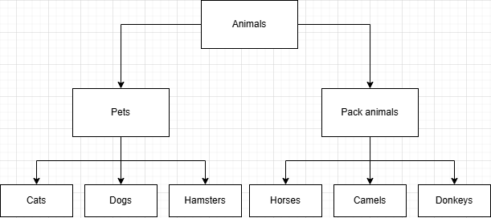

# 💻UBUNTU TASKS💻
## Task #1✅
1. > mkdir 'Final_project'
1. > cd Final_project/
1. >  cat > **pets.txt**
      Pes Tuzik
      Pes Tazik
      Piosik Sobaka
1. > cat > **packAnimals.txt**
      Coni Horse
      Osel Donkey
      Berbliud Camel
1. > cat pets.txt packAnimals.txt > mergedFile.txt
1. > cat **mergedFile.txt**
1. > mv mergedFile.txt **humansFriends.txt**

## Task #2✅
1. > mkdir **'New_dir'**
1. > mv -t **New_dir/ humansFriends.txt**

## Task #3✅
1. > sudo apt install **mysql-server**

## Task #4✅
1. > cd ~/'Загрузки'/
1. > sudo dpkg -i 'opera-stable_114.0.5282.115_amd64.deb'
1. > sudo dpkg -r opera-stable

## Task #5✅
Текущий документ доказывает выполнение пятого задания

# 🗄️MySQL TASKS🗄️
## TASK #6✅

## TASKS #7-#12✅
### Команды в Ubuntu:
1. > sudo mysql -u root -p
### Команды в MySQL:
Остальные команды для заданий 8-12 сохраненны в файле [``mySqlPart.sql``](mySqlPart.sql)

# Java
## Tasks #13-#14✅
Все файлы кода хранятся в папке [``Java``](Java/)

